<div align="center">
  
  <h1>🚀 Prompt Manager (PromptX)</h1>
  
  <p align="center">
    <strong>✨ 极致现代感 · 智能版本管理 · 跨平台同步</strong>
  </p>

  <p align="center">
    <a href="#核心功能">核心功能</a> •
    <a href="#快速开始">快速开始</a> •
    <a href="#docker-部署">Docker 部署</a> •
    <a href="#技术栈">技术栈</a>
  </p>

  
  
  
  
</div>

<br />

> **PromptX** 不仅仅是一个提示词存储工具，它是专为 AI 时代打造的生产力神器。采用 **UI/UX Pro Max** 设计标准，结合强大的 **版本管理** 和 **智能分类**，让你的 AI 工作流效率提升 10x。

## 项目架构

```
PromptX/
├── backend/          # FastAPI 后端
│   ├── app/
│   │   ├── main.py       # 应用入口
│   │   ├── config.py     # 配置管理
│   │   ├── database.py   # MongoDB 连接
│   │   ├── models/       # Pydantic 模型
│   │   ├── routers/      # API 路由
│   │   └── services/     # 业务逻辑（含邮件服务）
│   └── requirements.txt
│
└── frontend/         # React 前端
    ├── src/
    │   ├── pages/        # 页面组件
    │   ├── components/   # 通用组件
    │   ├── stores/       # Zustand 状态
    │   ├── api/          # API 客户端
    │   └── types/        # TypeScript 类型
    └── package.json
```

## 快速开始

### 1. 后端启动

```bash
cd backend

# 创建 conda 虚拟环境
conda create -n promptx python=3.10 -y
conda activate promptx

# 安装依赖
pip install -r requirements.txt

# 配置环境变量
cp .env.example .env
# 编辑 .env 填入你的 MongoDB 连接串、SMTP 配置

# 启动服务
uvicorn app.main:app --reload
```

API 文档: http://localhost:8000/docs

### 2. 前端启动

```bash
cd frontend

# 安装依赖
npm install

# 开发模式
npm run dev

# 生产构建
npm run build
```

访问: http://localhost:5173

## 技术栈

| 层级 | 技术 |
|------|------|
| **Backend** | Python 3.10+ / FastAPI / MongoDB (Motor) / JWT / SMTP |
| **Frontend** | React / TypeScript / Vite / Tailwind CSS / Zustand |

## 核心功能

### 个人提示词管理
- ✅ JWT 用户认证（登录/注册）
- ✅ **用户名或邮箱登录**
- ✅ **安全问题验证** - 注册时设置，用于找回密码
- ✅ **忘记密码** - 支持邮箱验证码和安全问题两种方式
- ✅ 提示词 CRUD（创建/读取/更新/删除）
- ✅ 智能分类（支持嵌套/树形结构、**展开/收起**）
- ✅ 一键复制（核心功能）
- ✅ 全局搜索
- ✅ **高级标签系统**（支持多选筛选、下拉快捷选择）
- ✅ **智能分页**（大数据量自动分页导航）
- ✅ **数据管理**（提供批量测试数据生成与清理脚本）
- ✅ 收藏功能
- ✅ **版本管理**（自动保存、差异对比、一键恢复）
- ✅ **AI 智能修改** - 一键调用 AI 优化提示词,自动拼接用户建议并发送修改
- ✅ 卡片/列表视图切换
- ✅ 提示词阅读弹窗
- ✅ 响应式布局（桌面/移动端适配）

### 🌐 公共模板库（NEW）
- ✅ **公共提示词库** - 浏览和搜索社区分享的优质提示词
- ✅ **动态分类系统** - 管理员可自定义分类（拖拽排序）
- ✅ **一键分享** - 将个人提示词分享到公共库（自动检测分类）
- ✅ **一键下载** - 将公共提示词添加到个人库
- ✅ **点赞系统** - 为优质提示词点赞，支持按点赞数排序
- ✅ **智能排序** - 支持按最新、最多点赞、最多下载排序
- ✅ **分页显示** - 自动分页，每页20条
- ✅ **每日免审核额度** - 每用户每天前3个上传自动通过审核

### 🛡️ 管理员功能（NEW）
- ✅ **审核中心** - 管理员可审核用户提交的公共提示词
- ✅ **批量管理** - 查看、搜索、删除公共库中的所有提示词
- ✅ **状态筛选** - 按待审核/已通过/已拒绝状态筛选
- ✅ **快速创建** - 管理员可在公共库直接新建提示词（无需经过个人库）
- ✅ **分类管理** - 新增/删除分类，拖拽调整分类顺序
- ✅ **管理员特权** - 上传无数量限制，自动通过审核

## 🔧 管理员设置

本项目提供管理员管理脚本，无需手动修改数据库。

### 使用方式

**交互式模式（推荐）：**
```bash
python create_admin.py
```

**命令行模式：**
```bash
# 将现有用户设为管理员
python create_admin.py --email user@example.com
python create_admin.py --username myuser

# 创建新管理员账户
python create_admin.py --create

# 查看当前管理员列表
python create_admin.py --list
```

### 首次部署流程

1. 启动服务后，通过网页注册一个普通账户
2. 运行 `python create_admin.py --email 你的邮箱` 将自己设为管理员
3. 刷新页面，侧边栏会出现"审核中心"入口

## 🧪 测试数据脚本

提供批量创建和删除测试数据的脚本，方便开发和测试。

### 创建测试数据

```bash
# 运行后会提示输入用户名和密码
python populate_test_data.py

# 或者设置环境变量后运行
export PROMPTX_USERNAME=your_username
export PROMPTX_PASSWORD=your_password
python populate_test_data.py
```

将在 `AI -> gemini` 分类下创建 30 个测试提示词。

### 删除测试数据

```bash
python delete_test_data.py
```

删除所有标题以"测试"开头、带有 `test` 和 `batch` 标签的提示词。

## 📸 界面预览

### 首页 & 登录

<div align="center">
  
  <p><em>精美的落地页，展示产品价值和核心功能</em></p>
</div>

<div align="center">
  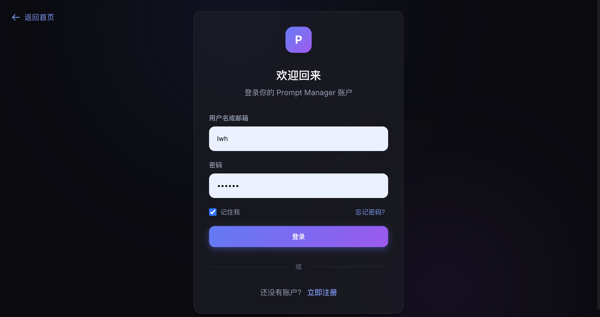
  <p><em>现代化的登录界面，支持用户名/邮箱登录</em></p>
</div>

<div align="center">
  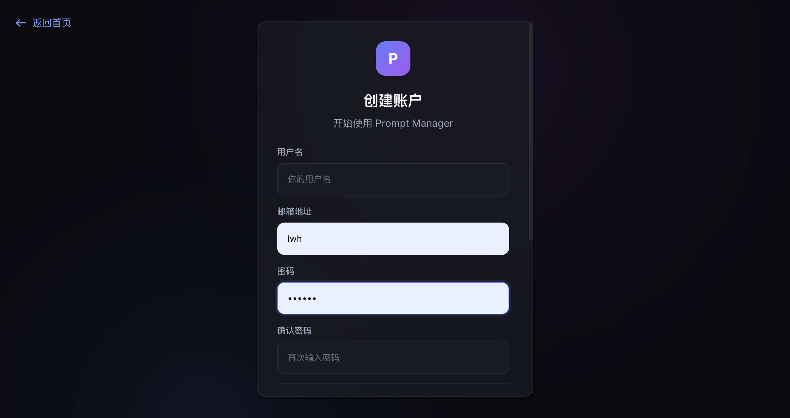
  <p><em>安全的注册流程，包含安全问题设置</em></p>
</div>

**首页** 采用深色玻璃态风格，醒目展示产品定位和核心价值。**登录/注册** 页面设计简洁优雅，支持用户名或邮箱登录，并提供安全问题验证机制。

---

### 主界面 & 智能分类

<div align="center">
  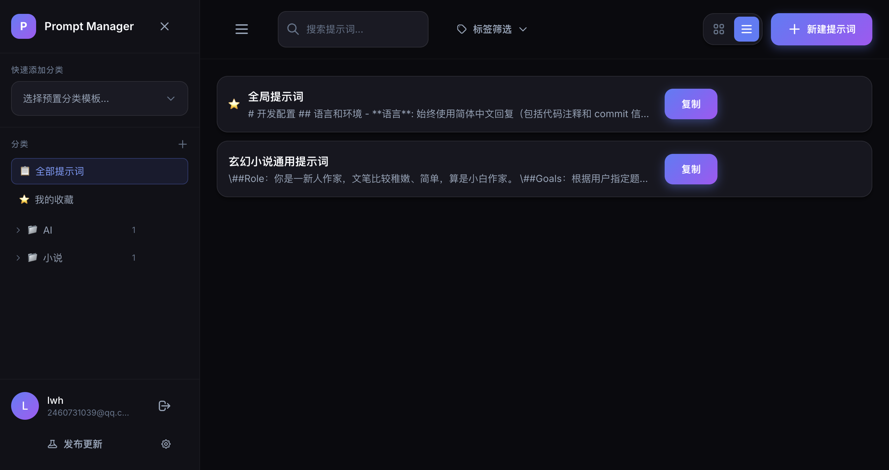
  <p><em>Dashboard 主界面 - Notion 风格的侧边栏布局</em></p>
</div>

<div align="center">
  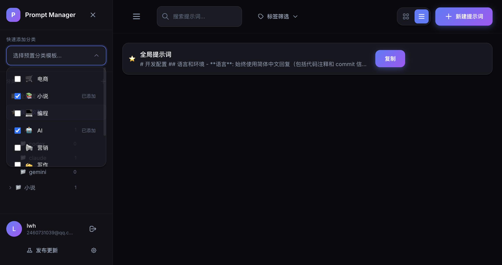
  <p><em>预置智能分类过滤器</em></p>
</div>

<div align="center">
  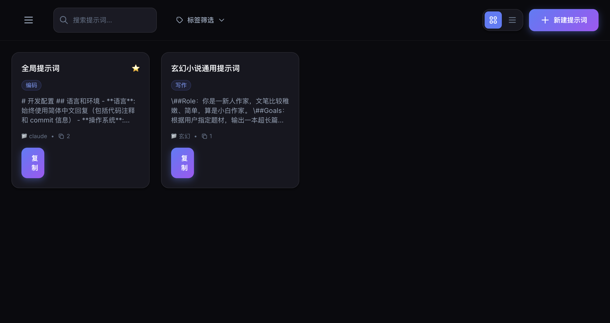
  <p><em>卡片式提示词展示</em></p>
</div>

**Dashboard** 采用经典的侧边栏 + 主内容区布局。左侧包含智能过滤器和分类树，右侧以精美卡片展示提示词，支持一键复制、编辑、收藏等操作。

---

### 核心功能

<div align="center">
  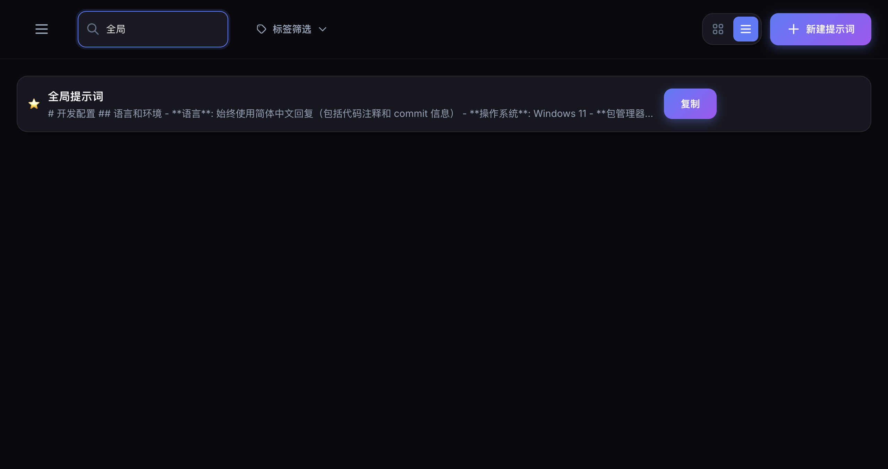
  <p><em>全局搜索 - 快速定位提示词</em></p>
</div>

<div align="center">
  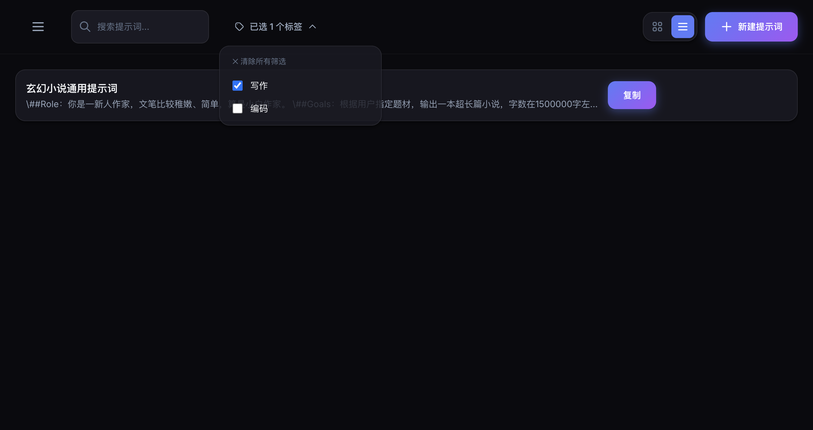
  <p><em>标签筛选 - 多维度过滤</em></p>
</div>

<div align="center">
  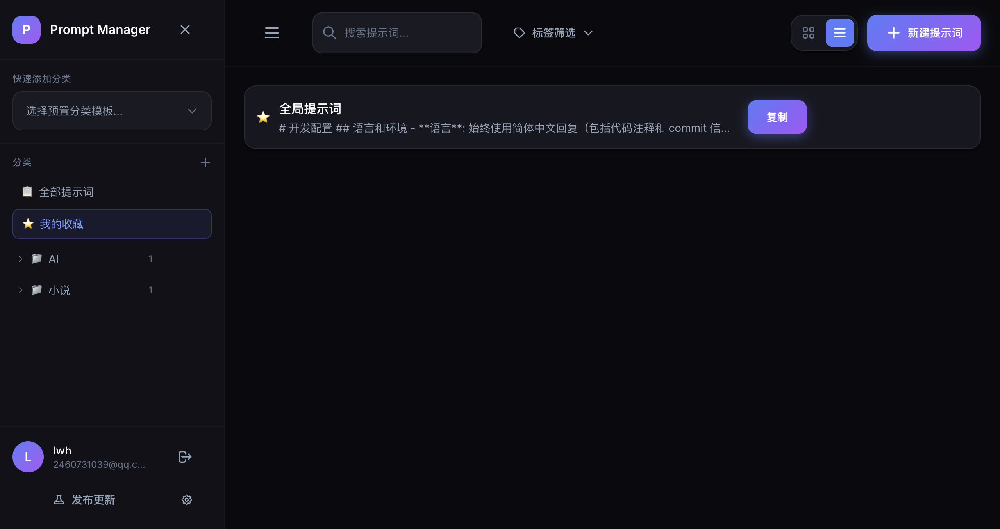
  <p><em>收藏功能 - 管理常用提示词</em></p>
</div>

<div align="center">
  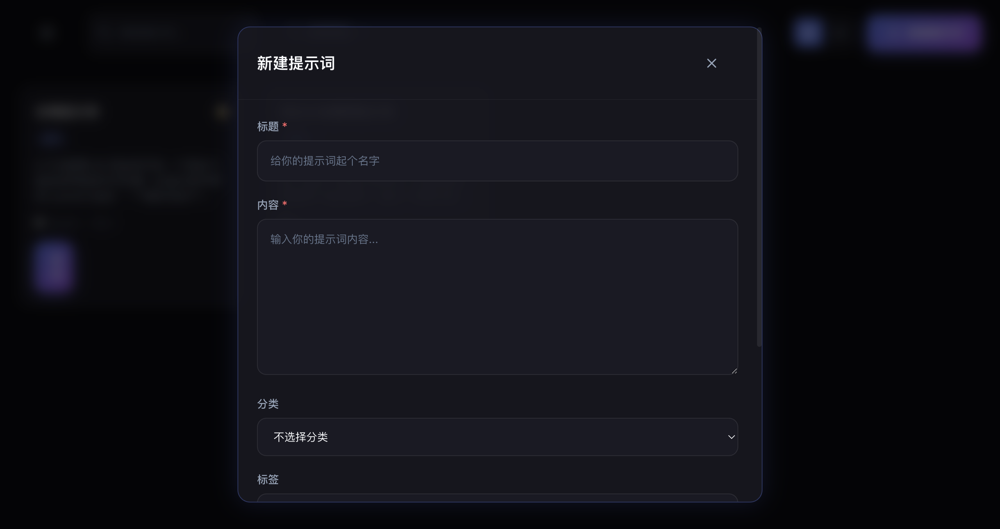
  <p><em>新建提示词 - 丰富的编辑选项</em></p>
</div>

<div align="center">
  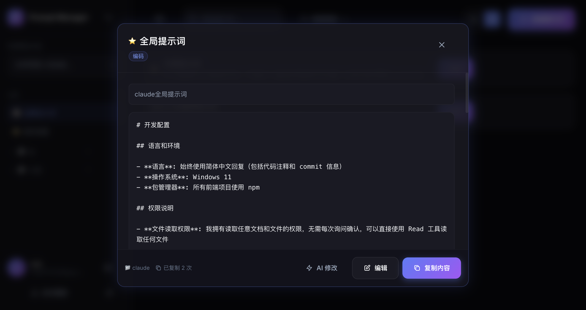
  <p><em>阅读模式 - 沉浸式查看体验</em></p>
</div>

**全局搜索** 支持关键词快速检索，**标签系统** 提供多选筛选功能，**收藏功能** 让常用提示词触手可及。创建新提示词时可设置分类、标签等元数据。

---

### 🤖 AI 智能修改

<div align="center">
  
  <p><em>AI 智能修改弹窗 - 输入修改建议，自动优化提示词</em></p>
</div>

点击提示词卡片上的 **AI 修改** 按钮，在弹窗中输入你的优化建议（如"让语气更专业"、"增加结构化格式"等），系统会自动将原提示词与你的建议拼接，发送给 AI 模型进行智能优化，生成改进版本。

---

### 📦 版本管理

<div align="center">
  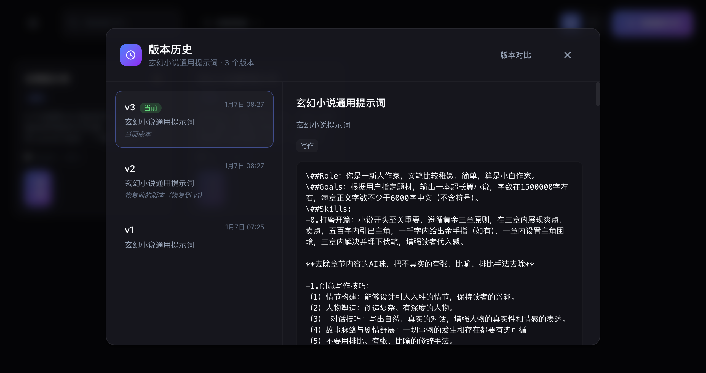
  <p><em>版本历史列表 - 自动保存每次修改</em></p>
</div>

<div align="center">
  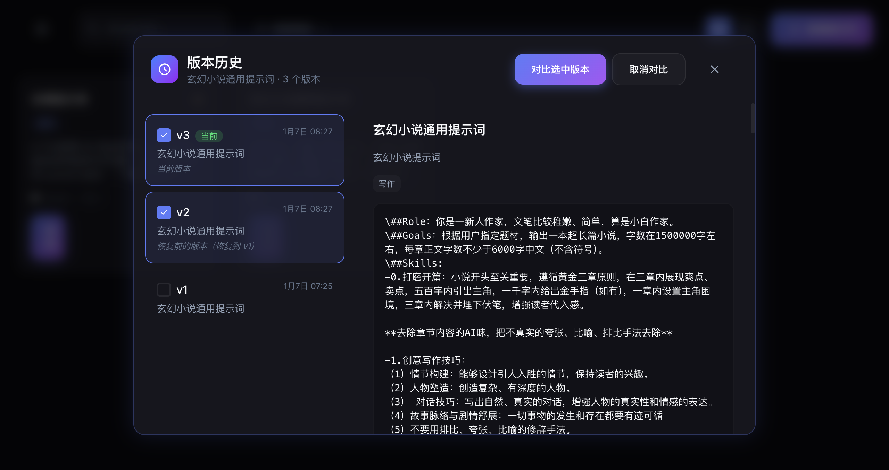
  <p><em>版本对比选择</em></p>
</div>

<div align="center">
  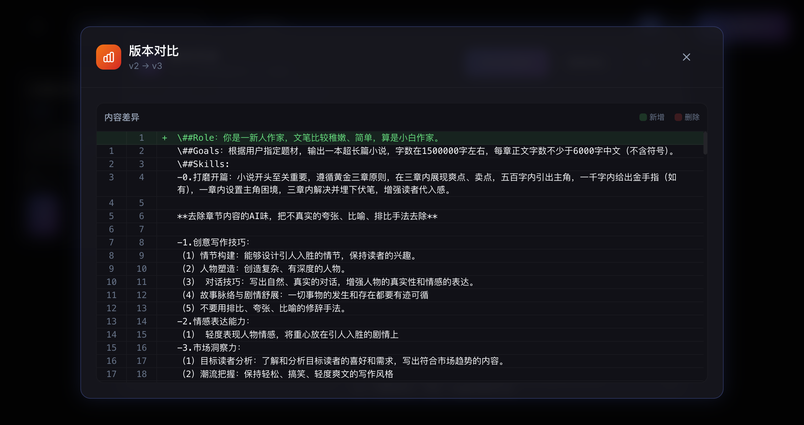
  <p><em>差异对比结果 - 清晰展示修改内容</em></p>
</div>

<div align="center">
  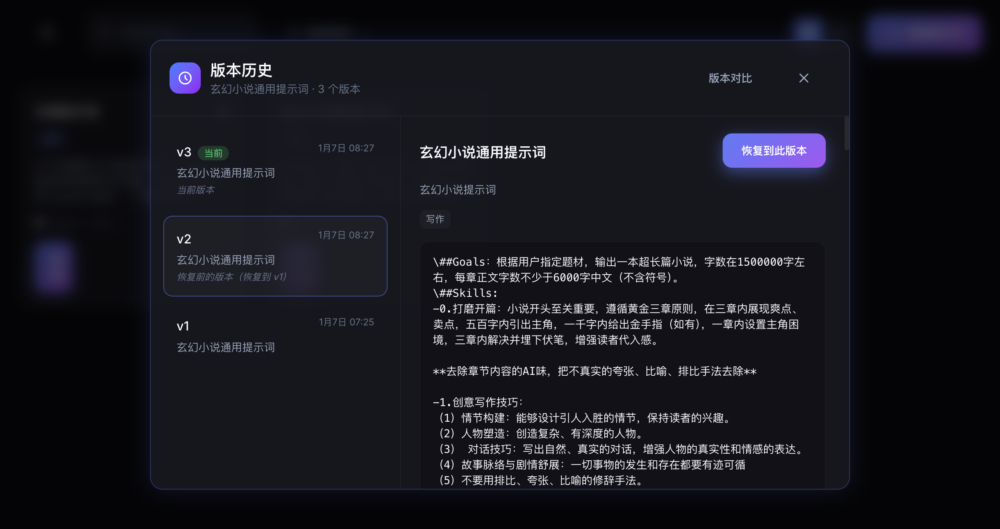
  <p><em>一键回退到历史版本</em></p>
</div>

**版本管理系统** 自动保存每次提示词修改，支持查看完整历史记录、对比任意两个版本的差异，并可一键恢复到历史版本。让你的提示词迭代过程有据可查，永不丢失灵感。

---

### 🌐 公共模板库

<div align="center">
  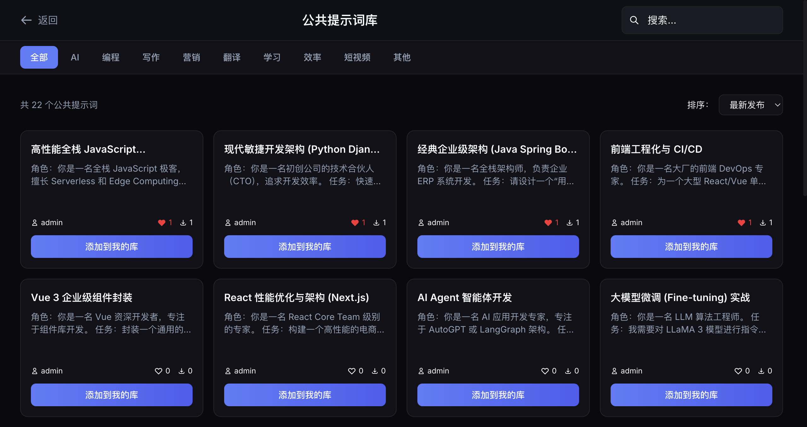
  <p><em>公共模板库主界面 - 浏览社区分享的优质提示词</em></p>
</div>

**公共模板库** 是 PromptX 的核心亮点功能之一，打造了一个 **提示词分享社区**。用户可以浏览、搜索、下载他人分享的优质提示词，也可以将自己精心打磨的提示词分享给社区。

**📤 一键分享提示词**

<div align="center">
  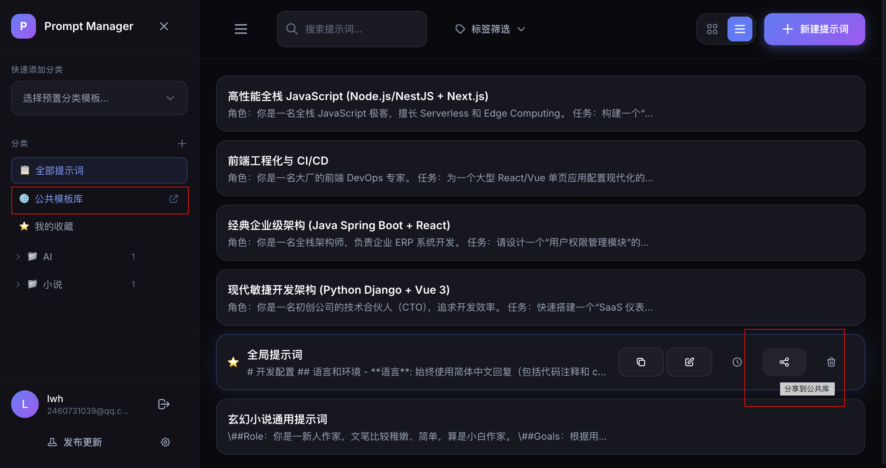
  <p><em>从个人库一键分享到公共库</em></p>
</div>

在个人提示词列表中，点击"分享到公共库"即可将提示词上传。每人每天有 **3 次免审核额度**，超过后自动进入审核队列，有效防止低质量内容泛滥。

**🔍 强大的搜索和排序**

<div align="center">
  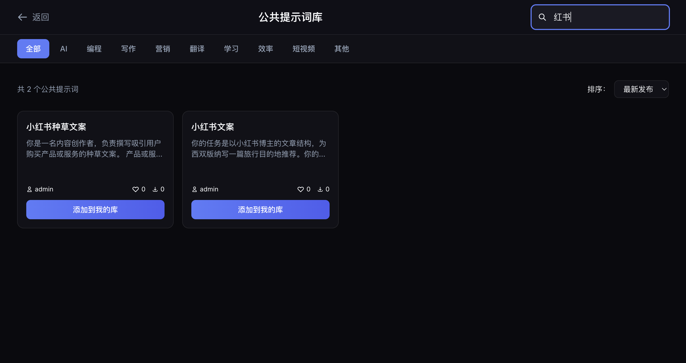
  <p><em>支持任意关键词搜索</em></p>
</div>

<div align="center">
  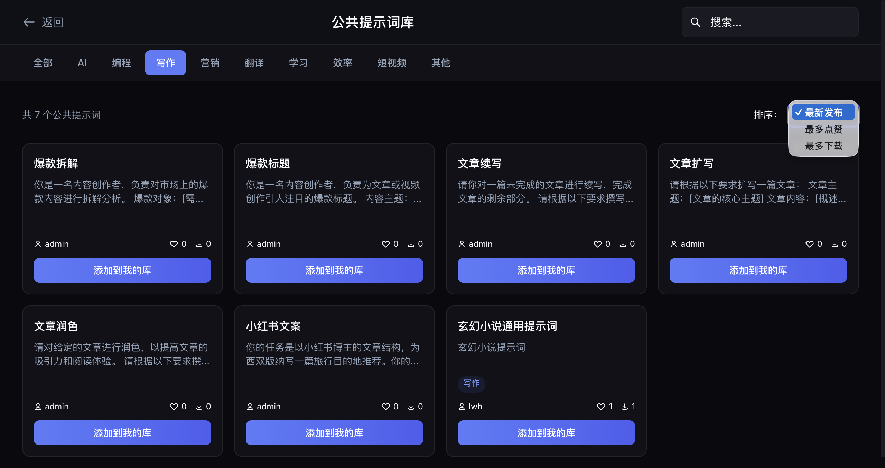
  <p><em>支持按分类筛选、点赞数排序、下载量排序</em></p>
</div>

公共库支持 **任意关键词搜索**，并提供多种排序方式：
- 📅 最新上传
- ❤️ 点赞最多
- 📥 下载最多

**📖 详情页深度查看**

<div align="center">
  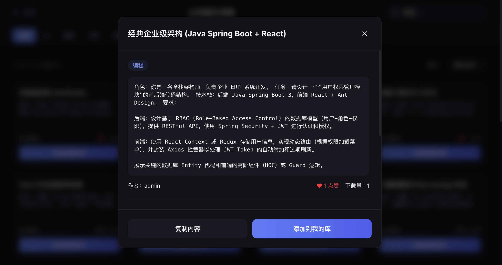
  <p><em>查看提示词完整内容和元信息</em></p>
</div>

点击任意提示词卡片进入详情页，可以查看完整内容、作者信息、点赞数、下载量，并一键下载到个人库。

**💬 评分与评论系统**

<div align="center">
  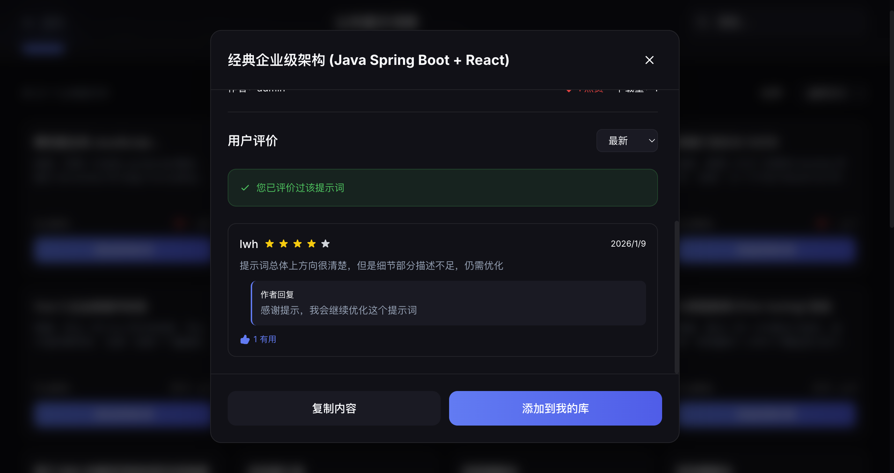
  <p><em>用户可以打分、评论，作者可以回复</em></p>
</div>

每个公共提示词都支持：
- ⭐ **5 星评分系统** - 为优质内容打分
- 💬 **评论互动** - 用户提问，作者回复
- 📊 **排序选项** - 按最新、最热评论排序

真实的社区反馈，帮助你找到最优质的提示词，避免踩坑。

---

### 🛡️ 管理员功能

**审核中心**

<div align="center">
  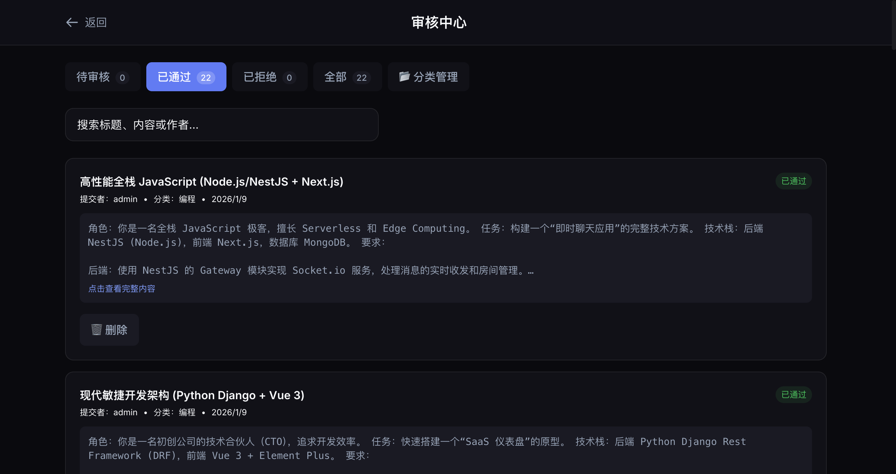
  <p><em>管理员审核待发布的提示词</em></p>
</div>

管理员拥有专属的 **审核中心**，可以：
- 查看所有待审核的提示词
- 通过或拒绝用户提交
- 按状态筛选（待审核/已通过/已拒绝）
- 快速搜索和批量管理

**分类管理**

<div align="center">
  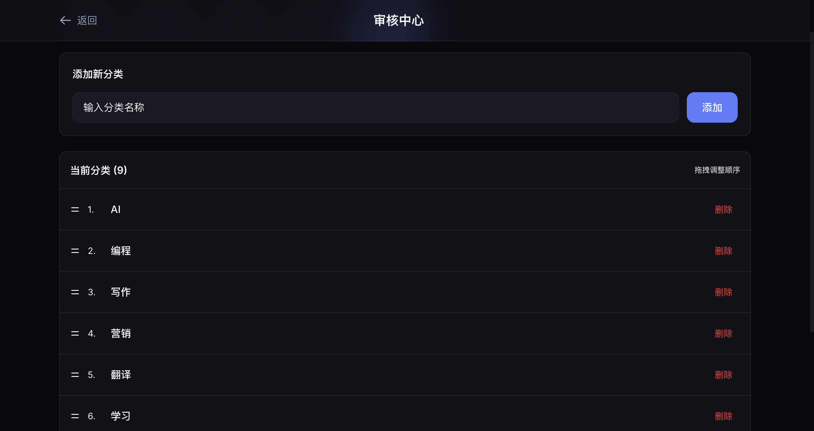
  <p><em>管理员新增自定义分类</em></p>
</div>

管理员可以为公共库创建和管理分类，支持：
- ➕ 新增自定义分类
- 🔄 拖拽调整分类顺序
- 🗑️ 删除不需要的分类

让公共库的内容组织更加合理和易于查找。

---

### 🔄 热更新机制

<div align="center">
  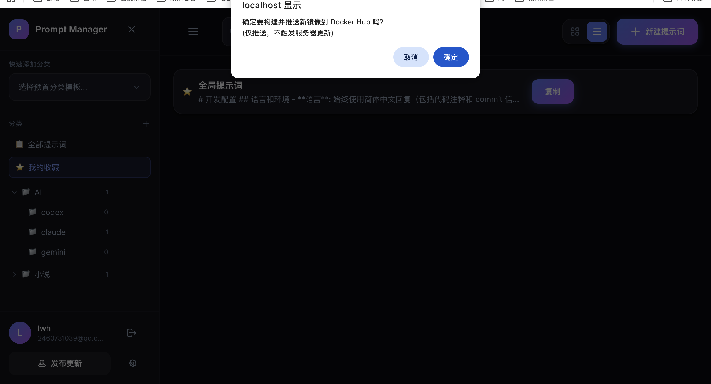
  <p><em>Docker 热更新配置</em></p>
</div>

<div align="center">
  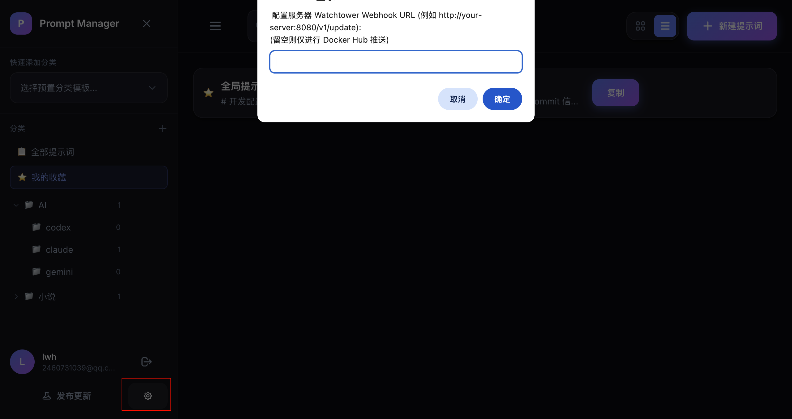
  <p><em>云端自动部署流程</em></p>
</div>

集成 **Watchtower** 服务，每 60 秒自动检测 Docker Hub 镜像更新。开发者推送新版本后，部署服务器会自动拉取并重启服务，实现零人工介入的持续部署。

---

## 邮件配置（可选）

用于密码重置功能，支持 QQ 邮箱、163 邮箱等 SMTP 服务。

### QQ 邮箱配置步骤：
1. 登录 [QQ邮箱](https://mail.qq.com)
2. 设置 → 账户 → POP3/SMTP服务 → 开启
3. 发送短信验证后获取 **16位授权码**
4. 在 `.env` 中配置：
```bash
SMTP_HOST=smtp.qq.com
SMTP_PORT=587
SMTP_USER=你的QQ邮箱
SMTP_PASSWORD=16位授权码
```

## 设计规范

采用 **UI UX Pro Max** 设计标准：
- 深色玻璃态主题
- 渐变配色系统
- 丰富微交互动画
- 完美响应式布局

## Docker 部署

### 方式一：直接运行（推荐）

无需下载源码，只需下载 `docker-compose.hub.yml` 和配置文件。

1. 下载配置文件：
   - [docker-compose.hub.yml](./docker-compose.hub.yml)
   - [.env.docker.example](./.env.docker.example) (重命名为 `.env`)

2. 编辑 `.env` 文件，填入你的 MongoDB 连接串。

3. 启动（指定配置文件）：
```bash
docker-compose -f docker-compose.hub.yml up -d
```

> **🔥 自动热更新已启用**：
> 默认集成了 `Watchtower` 服务，它会每 **60秒** 检查一次 Docker Hub。
> 当你推送新镜像时，部署服务器会自动拉取并重启服务，无需人工通过。

### 方式二：源码构建

如果你想自己修改代码并构建：

```bash
# 1. 复制环境变量配置
cp .env.docker.example .env

# 2. 编辑 .env 填入你的 MongoDB 连接串

# 3. 构建并启动
docker-compose up -d --build
```

访问: http://localhost

### 停止服务

```bash
docker-compose down
```

### 更新部署

```bash
git pull
docker-compose up -d --build
```

## App 迁移准备

本项目架构已为未来迁移做好准备：
- **Desktop App**: Tauri (CORS 已配置 `tauri://localhost`)
- **Mobile App**: Capacitor (CORS 已配置 `capacitor://localhost`)

## License

MIT
